# ASTROLABE
## Navigating the Universe of Formal Mathematics

**Whitepaper v1.0**
January 2026

---

## Abstract

Mathematics is the language of the universe. For centuries, it has been the privilege of the few. We believe it should belong to everyone.
The barrier is not intelligence — it's visibility. Formal proofs are powerful but opaque. The logic is rigorous, but the intuition is trapped in symbols that only experts can read.
Astrolabe is an open-source visualization framework for formal mathematics. We make proofs visible, interactive, and explorable — across Lean, Coq, and other formal languages.
We are building the interface layer for a new era of mathematical research: one where AI assists exploration, where learners can see what a proof means, and where the distance between curiosity and understanding collapses.
The future of mathematics is formal. The future of mathematics is visible. The future of mathematics is for everyone.

---
 
## 1. Problem Statement

### The Turning Point

We are at a turning point in the history of mathematics.

**AI is lowering the barrier to formal mathematics.** What once required months of learning formal proof languages can now be assisted by AI. Mathematicians no longer need to master Lean or Coq to participate — AI can help translate their ideas into verified proofs.

This opens unprecedented possibilities:
- **Pure mathematicians** can engage with formal verification without becoming programmers
- **Cross-disciplinary researchers** — physicists, economists, computer scientists — can formalize results in their fields
- **Students and curious minds** can explore and contribute to the frontier of mathematical knowledge

AI is making formal mathematics accessible. But the infrastructure has not caught up.

### The Interface Problem

Mathematical activity itself is changing. We need new ways to interact with it.

Existing tools were designed for the old paradigm: mathematicians writing proofs alone, in text, with static dependency graphs. They have served us well, but the age of AI-assisted mathematics demands something new.

We need:
- **More creative visual interfaces** — not just text, but dynamic, explorable representations of mathematical structures
- **New interaction patterns** — ways to collaborate with AI, to visualize dependencies in real-time, to navigate vast proof libraries intuitively
- **A space where everyone's insights matter** — not just professional mathematicians

Here is the opportunity: **AI-assisted programming and advancing AI hardware have democratized software creation.** You no longer need to be a professional developer to build interfaces. Anyone with a creative idea for how humans should interact with formal mathematics can now bring that idea to life.

We need everyone's inspiration. Astrolabe is the framework to make it happen.

### The Incentive Problem

Formal proofs are **perfect for blockchain storage** — they are deterministic, verifiable, and immutable. Yet there is no infrastructure to:
- Store and verify proofs on-chain
- Distribute rewards to AI mathematicians and human contributors
- Create transparent attribution for mathematical work

### The Paradigm Shift

Under the acceleration of AI, mathematics is changing. We need:
- **A new system for recording scientific contributions** — one that captures the collaborative, iterative nature of AI-assisted research
- **A new incentive structure** — one that rewards both the humans who guide AI and the community that builds better tools
- **A new research paradigm** — open, decentralized, and accessible to all

This is what Astrolabe and OpenMath are building together.

---

## 2. Solution

### Astrolabe: An Open Framework for Exploration

Astrolabe is not a finished product — it is an open-source framework inviting the community to explore and build together.

Astrolabe provides the foundation: 3D visualization of formal mathematics, automatic parsing of Lean projects, flexible node creation and annotation, and tools that work seamlessly with AI coding assistants.

But this is just the beginning. We are building toward a future where Astrolabe integrates with OpenMath's proof marketplace, supports multiple formal languages, and becomes the window through which anyone can explore the universe of verified mathematics.

### The Invitation

Astrolabe is a starting point, not an endpoint. We are searching for the best interaction patterns for AI-assisted mathematics — and we need your creativity.

In the future, AI + formal mathematics belongs to everyone. Not just mathematicians. Not just developers. **Everyone.**

Whether you are a mathematician with ideas about how proofs should be visualized, a designer imagining new interfaces, a student curious about the frontier of knowledge, or simply someone with a vision for how humans and AI should collaborate — Astrolabe is your canvas.

**Join us in shaping the future of mathematics.**

---

## 3. Ecosystem Architecture

```mermaid
flowchart TD
    subgraph Users["👥 CONTRIBUTORS"]
        V["🎨 Visualizers"]
        B["🔧 Builders"]
        E["📚 Educators"]
        G["🌱 Growers"]
        R["🔍 Reviewers"]
    end

    subgraph Astrolabe["🔭 ASTROLABE"]
        UI["3D Visualization · AI Integration"]
        AP["⭐ ASTRO Points System"]
        GOV["🗳️ Governance"]
    end

    subgraph OpenMath["📐 OPENMATH"]
        PM["Proof Marketplace"]
        BT["Bounty System"]
        CTK["💰 CTK Token"]
    end

    subgraph Shentu["⛓️ SHENTU CHAIN"]
        SC["Smart Contracts"]
        OCV["On-chain Verification"]
    end

    subgraph Library["📖 VERIFIED MATH LIBRARY"]
        LP["Lean4 Proofs · Formal Theorems"]
    end

    V & B & E & G & R -->|Contribute| UI
    UI --> AP
    AP -->|Points| GOV
    AP -.->|Convert| CTK
    UI --> PM
    PM --> BT
    BT --> CTK
    CTK --> SC
    SC --> OCV
    OCV --> LP
```

### Layer Responsibilities

| Layer | Function |
|-------|----------|
| **Astrolabe** | User acquisition, visualization, AI interaction |
| **OpenMath** | Proof marketplace, bounty management, reward distribution |
| **Shentu Chain** | On-chain verification, immutable storage, token transactions |

---

## 4. Incentive System

### The Astrolabe Ecosystem
Astrolabe operates its own contribution recognition system — **ASTRO Points** — designed to track, reward, and incentivize all forms of contribution to the project. ASTRO Points functions as an off-chain credit system with a clear pathway to integration with the broader OpenMath ecosystem and CTK token.

---

## 4.1 Contribution Categories

| Category     | Description                                                                 | Reward Mechanism                                                     |
|-------------|-----------------------------------------------------------------------------|----------------------------------------------------------------------|
| Visualizers | Designers, frontend developers, and mathematicians who create interactive visualizations for formal proofs | Points based on complexity, reusability, and community adoption      |
| Builders    | Core developers who contribute to Astrolabe's codebase, architecture, and infrastructure | Points based on PR size, impact, and code review participation       |
| Educators   | Contributors who create tutorials, documentation, translations, and educational content | Points based on content quality and reach                            |
| Growers     | Community organizers, partnership developers, and advocates who expand the ecosystem | Points based on measurable ecosystem impact                           |
| Reviewers   | Community members who review visualizations, test features, and provide quality feedback | Points based on review volume and constructiveness                   |

---

## 4.2 Reward Mechanism

### Visualization Rewards
Astrolabe implements a quality-based incentive mechanism for visualizations:
- Visualizations are evaluated based on clarity, interactivity, and educational value
- First visualization for a theorem earns bonus rewards
- Reusable components that benefit multiple proofs earn higher rewards
- Community citations and adoption increase reward multipliers

### Builder Rewards
Code contributors are rewarded based on:
- Pull request size and complexity (small / feature / major)
- Code review participation and quality
- Bug fixes and issue resolution
- Architecture and infrastructure improvements

### Education Rewards
Content creators are rewarded based on:
- Tutorial and documentation contributions
- Video content production
- Translation work (per volume)
- Community Q&A participation

### Bounty System
- Core team and community members can post bounties for specific visualizations or features
- Contributors claim bounties by submitting work that meets acceptance criteria
- Bounty rewards are distributed upon maintainer approval
- Future integration: smart contract distribution upon on-chain verification

---

## 4.3 Points Allocation

| Allocation        | Percentage | Distribution               |
|------------------|------------|----------------------------|
| Visualizers Pool | 30%        | Ongoing, per contribution  |
| Builders Pool    | 25%        | Ongoing, per contribution  |
| Educators Pool   | 20%        | Ongoing, per contribution  |
| Growers Pool     | 15%        | Ongoing, per contribution  |
| Reviewers Pool   | 10%        | Ongoing, per contribution  |

**Note:** Allocation percentages represent target distribution across contribution types. Actual distribution depends on community participation.

---

## 4.4 Levels & Recognition
Contributors progress through levels based on accumulated points:

| Level | Title         | Points  | Recognition                                         |
|------:|---------------|---------|-----------------------------------------------------|
| 1     | Explorer      | 0+      | Community access                                    |
| 2     | Contributor   | 100+    | Private channels, early access to features          |
| 3     | Builder       | 500+    | Governance participation, quarterly sync invites    |
| 4     | Architect     | 2,000+  | Product advisory input, partnership referrals       |
| 5     | Founder Circle| 5,000+  | Core decision participation, priority token allocation |

---

## 4.5 Point Dynamics

### Activity-Based Valuation
ASTRO Points represent current contribution activity, not just historical records:
- 30 days inactive: **2%** decay
- 60 days inactive: **5%** decay
- 90 days inactive: **10%** decay

### Protections
- New contributors: **90-day decay protection**
- Level floor: Points will not decay below current level threshold

---

## 4.6 Transparency & Verification
All ASTRO Points records are maintained in a public GitHub repository:
- Every transaction is logged with timestamp, action type, and reference
- Git commit history provides immutable audit trail
- Anyone can verify point calculations and totals
- Weekly snapshots published for community review

---

## 4.7 OpenMath Integration
ASTRO Points is designed for seamless integration with the OpenMath ecosystem:

### Current State
- Off-chain point system
- Public ledger on GitHub
- Manual + semi-automated tracking

### Integration Pathway
- Periodic snapshots for on-chain anchoring (Merkle root)
- Conversion mechanism to CTK based on published formula
- Governance participation rights through point-weighted voting

### Conversion
- ASTRO Points → CTK conversion rates determined by OpenMath governance
- Snapshot timing and eligibility criteria announced in advance
- Vesting schedules may apply to converted tokens

For detailed tokenomics and CTK distribution mechanisms, see OpenMath documentation.

---

## 4.8 Governance
ASTRO Points holders participate in Astrolabe-specific governance:
- Point-weighted voting on visualization standards and feature priorities
- Proposal rights for Builder level (500+) and above
- Core decisions reserved for Founder Circle with community input
- Ecosystem-wide decisions (cross-project, token economics) are governed through OpenMath governance mechanisms.

---

This incentive system is subject to revision as the project evolves. Major changes will be announced through official channels and require community input for significant modifications.

---

## 5. Partners

### Core Partnership

Astrolabe partners with **OpenMath** to bring formal mathematics to everyone. OpenMath provides the proof marketplace and on-chain incentive infrastructure; Astrolabe provides the interface that makes it accessible.

Together, we create a complete ecosystem: **accessible, incentivized, and open to all.**

### Ecosystem Partners

| Organization | Role | Contribution | ASTRO Points Role |
|--------------|------|--------------|-------------------|
| **CertiK** | Blockchain Infrastructure | Shentu Chain, on-chain verification, security | Builders · Founder Circle |
| **Feishu (菲数)** | Academic Bridge | Mathematician network, institutional partnerships, China-global collaboration | Growers · Educators |
| **RiskLab** | Quantitative Research | Risk modeling, industry connections | Educators · Reviewers |

---

## 6. Conclusion

Mathematics is changing. AI is lowering the barriers. Formal verification is becoming accessible. The tools we use to explore, create, and share mathematical knowledge must evolve with it.

Astrolabe is our contribution to this evolution — an open framework for the community to discover the best ways to interact with formal mathematics in the age of AI.

We are not building for mathematicians alone. We are building for everyone who believes that mathematical knowledge should be open, verifiable, and rewarding to create.

**The future of mathematics is formal. The future of mathematics is open. The future of mathematics is for everyone.**

Join us.

---

*© 2026 Astrolabe. All rights reserved.*
